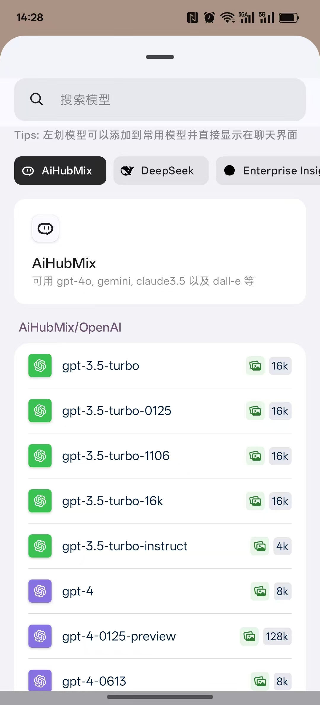
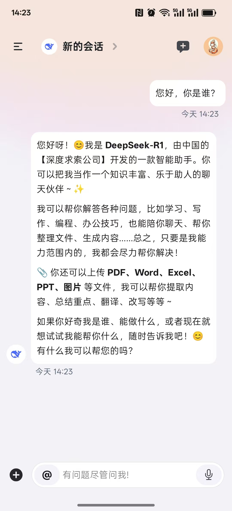
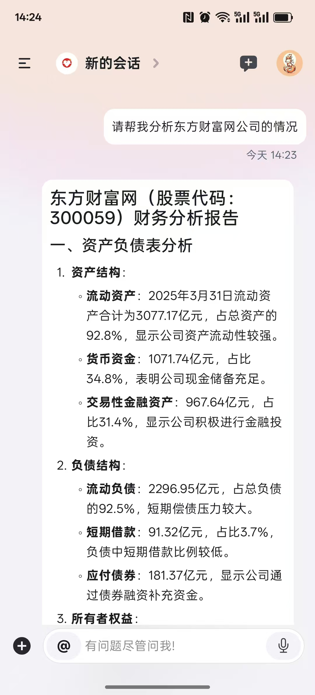
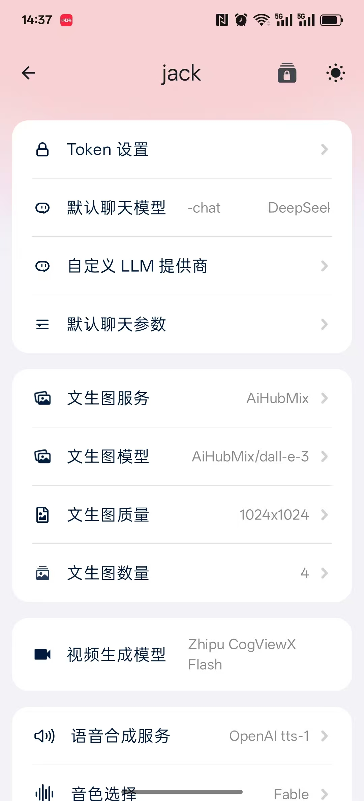

# 🚀 multimind-mobile — Your Intelligent Assistant App

**English** | [Simplified Chinese](readme-zh.md)

[](https://github.com/jackdark425/aigroupapp/releases)
[](https://github.com/jackdark425/aigroupapp/stargazers)


> **Project name:** multimind-mobile. The release and star badges, clone command, screenshot paths, and repository link below refer to the original [AI Group Mobile App repository](https://github.com/jackdark425/aigroupapp). Keep the original clone URL if using that source; replace these links with your own repository once available.

**multimind-mobile** is an Android intelligent assistant app that brings multiple large language models and AI services together in one mobile interface.

## ✨ Core Features

- 🤖 **Multi-Model Integration** — Supports OpenAI, Claude, Gemini, ERNIE Bot, Qwen, and other providers.
- 🔌 **Custom Services** — Add and manage custom LLM API endpoints with `CustomLLMProvider`.
- 🎨 **Theme Customization** — UI themes and personalization options.
- 📱 **Mobile Optimized** — Designed for smooth interaction on Android devices.
- 🔒 **Privacy Protection** — Local data encryption and secure API communication.

## 🛠️ Installation & Usage

1. Clone the original source repository:

   ```bash
   git clone https://github.com/jackdark425/aigroupapp.git
   ```

2. Open the cloned project in Android Studio.
3. Configure the required values in `gradle.properties`.
4. Connect an Android device or start an emulator.
5. Click **Run** to deploy the app.

## 📸 App Screenshots

<div align="center">

<table>
  <tr>
    <td align="center" width="50%">
      <h4>🏠 Model Selection</h4>
      
    </td>
    <td align="center" width="50%">
      <h4>🤖 Chat</h4>
      
    </td>
  </tr>
  <tr>
    <td align="center" width="50%">
      <h4>💬 Custom Assistant Chat</h4>
      
    </td>
    <td align="center" width="50%">
      <h4>⚙️ Settings</h4>
      
    </td>
  </tr>
</table>

</div>

## 🤝 Contributing

To contribute to the repository linked above:

1. Fork the repository.
2. Create a feature branch: `git checkout -b feature/AmazingFeature`.
3. Commit your changes: `git commit -m 'Add some AmazingFeature'`.
4. Push: `git push origin feature/AmazingFeature`.
5. Open a pull request.

## ⭐ Original Repository

[](https://star-history.com/#jackdark425/aigroupapp)

## 📜 License

The linked original repository is licensed under the MIT License; see its [LICENSE](LICENSE) file for details.
